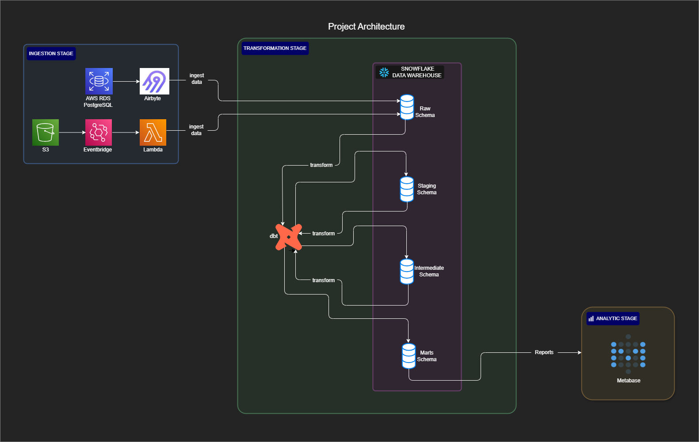
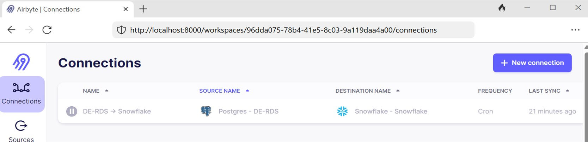
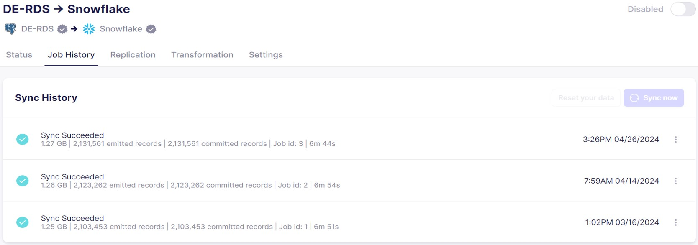
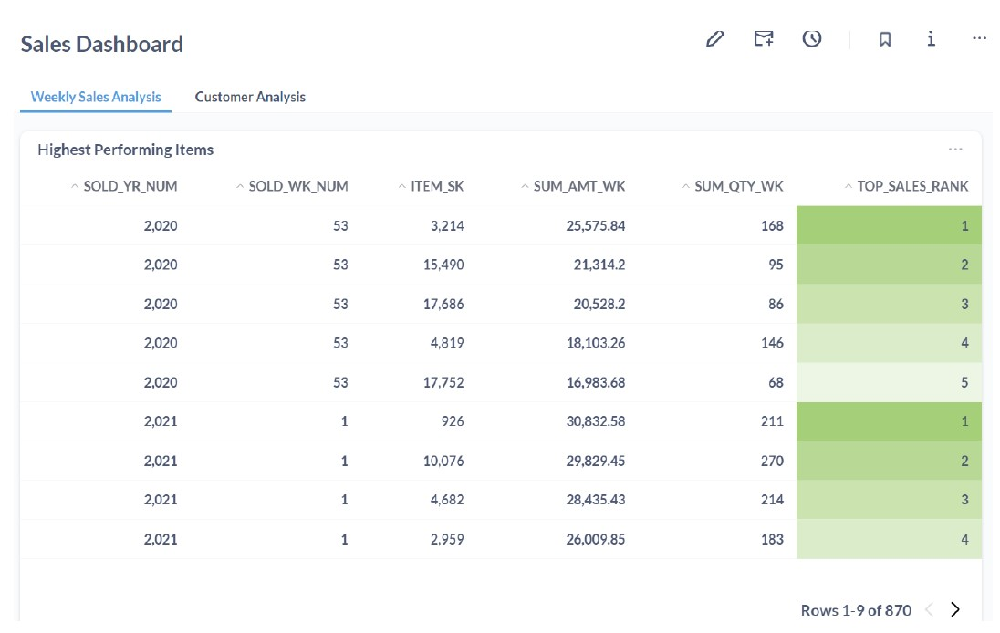

# WCD Phase 1 Project

## Overview

The **WCD Phase 1 Project** is an Analytical Data Engineering initiative that involves ingesting data from multiple sources into a Snowflake data warehouse. After a series of transformations using dbt, the data is prepared for analytics and business intelligence reporting, which is conducted using Metabase.

 

<i>Project Architecture diagram below:</i>

 

## Table of Contents

- [Features](#features)
- [Technologies](#technologies)
- [Data Ingestion](#data-ingestion)
- [Data Transformation](#data-transformation)
- [Testing](#testing)
- [Business Intelligence](#business-intelligence)

## Features

- Ingestion of data and integration with Snowflake for data warehousing
- Data transformation with dbt
- Business intelligence reporting, dashboards, and visualizations with Metabase

## Technologies

- **Data Storage and Warehousing:** Snowflake
- **Data Ingestion:** Airbyte, AWS Lambda
- **Data Transformation:** dbt, Python, SQL
- **Business Intelligence:** Metabase
- **Cloud Services:** AWS (CloudShell, CloudWatch, EC2, EventBridge, IAM, Lambda, S3)

## Data Ingestion

Data is ingested from two sources:

### Data Ingestion and Integration with Snowflake using Airbyte

Data is ingested from the TPC-DS database in AWS RDS PostgreSQL into the RAW schema of the Snowflake database using **Airbyte**. The data consists of the retail sales dataset from the relational TPC-DS database.

 

<i>See screenshot of Airbyte connection from PostgreSQL to Snowflake below:</i>

 

 

<i>Airbyte ingestion job screenshot below:</i> 

 

 

### Data Ingestion and Integration with Snowflake Using AWS Lambda

Inventory data is ingested from an API source and saved to an AWS S3 bucket, from which it will be loaded into the RAW schema of the TPC-DS database in Snowflake using a python-based **AWS Lambda function**. For detailed implementation of the ingestion process into Snowflake with Lambda, refer to the [Lambda function](/LambdaCode/lambda_function.py).

 

<i>Lambda ingestion screenshot below:</i>

 

<table style="width: 100%; border-collapse: collapse;">
  <tr>
    <td style="width: 40%; padding: 10px; vertical-align: top; border-right: 1px solid #ddd;">
      
    </td>
    <td style="width: 40%; padding: 10px; vertical-align: top;">
      
    </td>
  </tr>
</table>

 

  [Back to Table of Contents](#table-of-contents) &nbsp; [Back to Top](#overview)

 

## Data Transformation

The ingested data undergoes three stages of transformations within Snowflake using **dbt**. dbt is used for building the required models to various phases such as: Staging, Intermediate and Mart. These phases or stages are persisted to the snowflake data warehouse in the form of schemas

1. In the *first stage*, the data from the RAW schema undergoes basic transformations, such as column renaming, selecting the needed columns, and so on. The output of these first-stage transformations is stored in the **staging schema** of the TPC-DS Snowflake database. For further details, refer to files in the folder [Staging](./dbt_projects/dbt_tpcds/models/staging/tpcds/) for Staging schema transformations.

2. The *second stage* further transforms the data in the staging schema and stores the final result in the **intermediate schema** of the TPC-DS Snowflake database. At this stage, intermediate transformations are performed to make the data ready for the next stage. Examples include computing daily sales aggregation, which will be used in weekly sales aggregation. For further details, refer to the files in the folder [Intermediate](./dbt_projects/dbt_tpcds/models/intermediate/sales/) for intermediate schema transformations.

3. The *final stage* performs additional transformations, such as weekly sales aggregation over the daily sales aggregation, on the data in the intermediate schema and stores the output in the **Marts schema** of the same Snowflake database. For details, refer to the files in the folder [Marts](./dbt_projects/dbt_tpcds/models/marts/sales/) for Marts schema transformations.

 

<i>Marts Schema screenshot below:</i>

 

 

<i>See below the data lineage of the data flow in the project:</i>

 

 

  [Back to Table of Contents](#table-of-contents) &nbsp; [Back to Top](#overview)

 

## Testing

To ensure data quality, various tests were performed to validate the integrity and accuracy of the data throughout the pipeline. These tests included:

1. **Schema Tests**
2. **Uniqueness Tests**
3. **Not Null Tests**
4. **Referential Integrity Tests**
5. **Accepted Values Tests**
6. **Subset Validation Tests**

Refer to the folder [Tests](./dbt_projects/dbt_tpcds/tests/), [Macros](./dbt_projects/dbt_tpcds/macros/), and the [Schema file](./dbt_projects/dbt_tpcds/models/schema.yml) for tests implemented.

 

<i>See screenshots of tests below:</i>

 

<table style="width: 100%; border-collapse: collapse;">
  <tr>
    <td style="width: 40%; padding: 10px; vertical-align: top; border-right: 1px solid #ddd;">
      
    </td>
    <td style="width: 40%; padding: 10px; vertical-align: top;">
      
    </td>
  </tr>
</table>

 

  [Back to Table of Contents](#table-of-contents) &nbsp; [Back to Top](#overview)

 

## Business Intelligence

**Metabase** is now connected to the transformed data in the Marts schema of the TPC-DS database in Snowflake and is used to create dashboards and reports. Refer to the folder [Report Files](./Reports/) for PDF files containing reports screenshots.

One of the report screenshot extract below

 

 

## Acknowledgements

Thanks to the WeCloudData team for their support and collaboration throughout this project.

 

  [Back to Table of Contents](#table-of-contents) &nbsp; [Back to Top](#overview)

